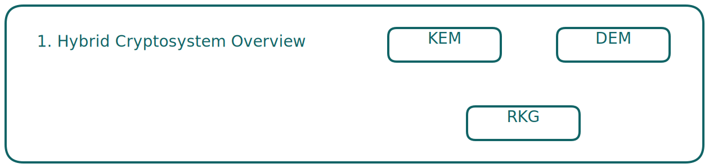
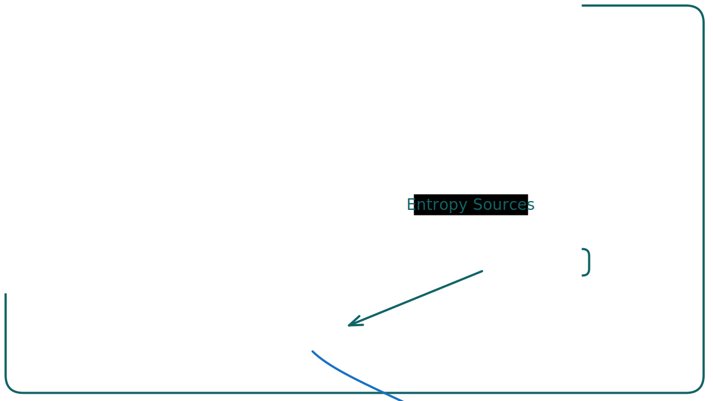
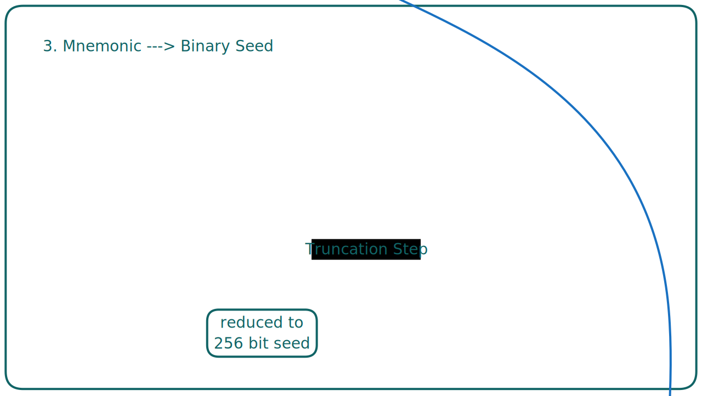
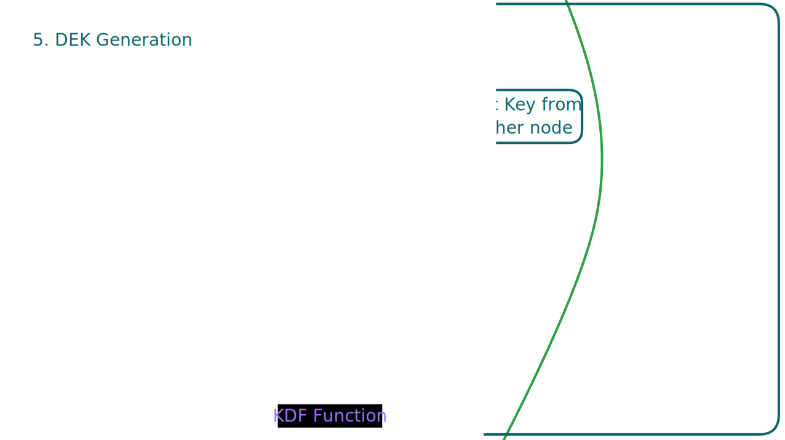
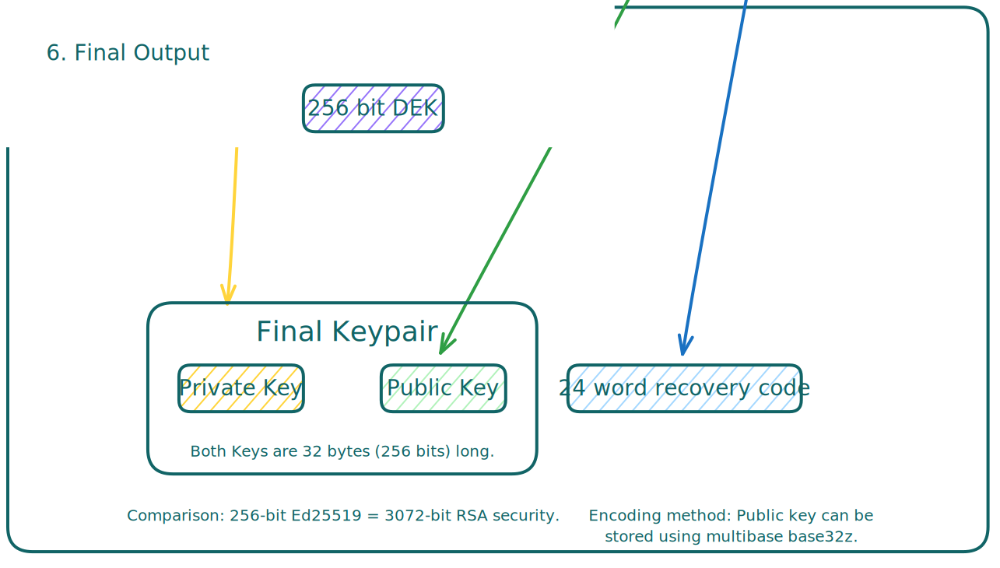

# Root Keypair Generation in Polykey

Polykey’s entire encryption model revolves around Hybrid Elliptic Curve Integrated Encryption Scheme (ECIES), and the Root Keypair is the foundation of everything. It’s the cryptographic identity of a node, making secure communication, encryption, and key derivation possible.

This doc covers:
 * What the Root Keypair is.
 * How it’s generated.
 * How it spits out a DEK (Data Encryption Key).

---

## What is the Root Keypair? 
The Root Keypair is an Ed25519 elliptic curve keypair that serves as the node’s identity in Polykey.

It’s made up of:
 * Private Key: A 256-bit secret, randomly generated and never shared.
 * Public Key: Derived from the private key and used for authentication and key exchange.

### Why do we care? 
1. Identity: Every Polykey node has a unique Root Public Key.
2. Key Exchange: It’s used in the Key Encapsulation Mechanism (KEM) to securely share encryption keys.
3. Data Encryption: It’s how we derive a DEK, which encrypts stored data.

---

## Hybrid Cryptosystem Overview 
Before generating the Root Keypair, we need to understand how encryption works in Polykey.

A hybrid cryptosystem consists of:
1. Key Encapsulation Mechanism (KEM): Uses asymmetric encryption (Ed25519) to securely transmit a symmetric key.
2. Data Encapsulation Scheme (DEM): Uses symmetric encryption (AES/ChaCha20) for bulk encryption of Polykey’s state.

Before we can encrypt anything, we must generate the Ed25519 Root Keypair.

---

## Generating the Root Keypair 
The process is deterministic, secure, and clean.

### Root Keypair Generation Begins 
 * The user or console triggers keypair generation.
 * The system gathers high-entropy randomness to ensure security.

---

### BIP39 Wordlist & Recovery Code 
 * Entropy is converted into a mnemonic phrase using the BIP39 English Wordlist .
 * The 24-word recovery code represents 264 bits of entropy.

---

### Mnemonic to Binary Seed 
 * The 24-word recovery code is converted into a binary seed using PBKDF2.
 * Uses HMAC-SHA512 with 2048 iterations.
 * The binary seed is 512 bits, then truncated to 256 bits.

---

### Generating the Keypair 
 * The 256-bit seed is fed into the Ed25519 algorithm to generate a private key.
 * Scalar multiplication is performed to derive the public key.

---

## How is the DEK Made? 
The Data Encryption Key (DEK) is derived from the Root Keypair using a Key Derivation Function (KDF).

1. Elliptic Curve Diffie-Hellman (ECDH) 
  * The Root Private Key and another node’s Public Key are combined to create a shared secret.
 
2. Run It Through a KDF 
  * A Key Derivation Function (likely HKDF-SHA256) converts the shared secret into a 256-bit symmetric DEK.

3. Store or Re-Derive the DEK 
  * The DEK is either stored securely or regenerated when needed.

---

## Final Output: The Root Keypair 
 * The final result is a Public and Private Keypair, each 32 bytes (256 bits) long.
 * Key size benefits:
  * More efficient than RSA prime factorization.
  * 256-bit Ed25519 key provides same security as a 3072-bit RSA key.
  * Public key can be encoded using multibase base32z.

---

## Wrapping It Up 
The Root Keypair is the foundation of Polykey’s encryption model. It enables:
* Secure messaging 
* Key exchange 
* Encryption using Ed25519 elliptic curve cryptography .

The DEK, derived from the Root Keypair, locks down all stored data with strong encryption. 
This entire setup is faster, more efficient, and more secure than traditional RSA-based encryption.

That’s it. Root Keypair = Identity. DEK = Encrypted data. Simple, secure.