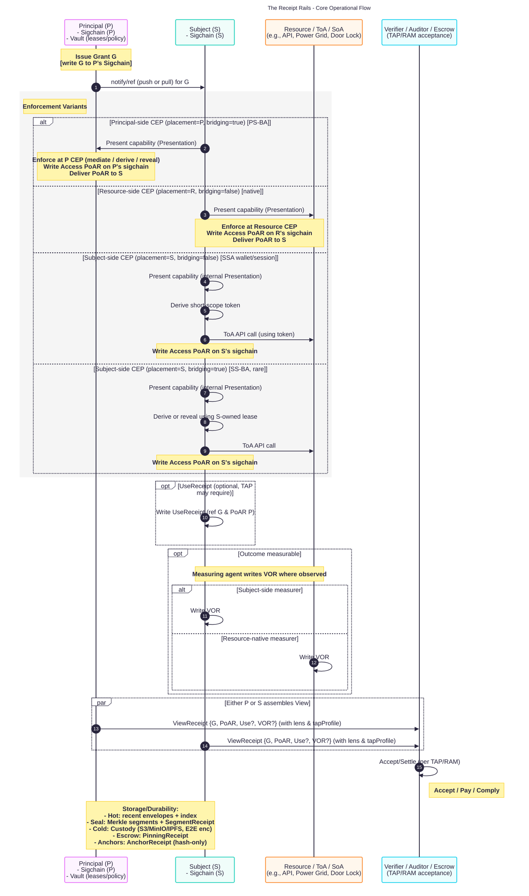
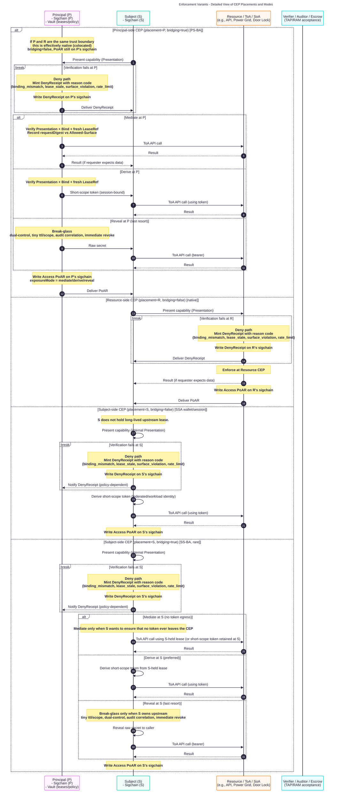

# Receipt Rails Operational Flow

This document outlines the fundamental operational flow of the Polykey
ecosystem, which we call the Receipt Rails. It illustrates the complete
lifecycle of a verifiable event, from the initial grant of authority to the
final acceptance of a cryptographic receipt by a third party.

The core principle of the Receipt Rails is to create a standardized, secure, and
auditable process for proving that a specific action was performed or a specific
outcome was achieved. This is accomplished through a sequence of interactions
between four key actors: the Principal (who grants authority), the Subject (who
performs the action), the Resource (the target of the action), and the Verifier
(who accepts the proof).

Below are two diagrams. The first provides a high-level, summary view of the
entire flow. The second diagram is a detailed, technical zoom-in on the most
critical and complex step: the Enforcement of a capability. Understanding both
is key to grasping the full power and flexibility of the system.

## Core Operational Flow (Summary View)

This diagram shows the end-to-end lifecycle. It begins with a Principal issuing
a Grant, which authorizes a Subject to perform an action. The Subject then
presents this authority to an Enforcement Point, which results in the minting of
verifiable receipts. These receipts are then assembled into a View for a
Verifier, who can accept them for settlement, compliance, or payment.

### How to Read This Diagram

- Participants:
  - P (Principal): The entity granting authority (e.g., a DevOps lead, a
    homeowner).
  - S (Subject): The entity performing the action (e.g., a CI/CD runner, a smart
    lock app).
  - R (Resource): The target of the action (e.g., a Kubernetes API, a Power
    Grid, a Door Lock).
  - V (Verifier): The entity that needs proof (e.g., an Auditor, an Insurer, an
    Escrow agent).
- The Happy Path: The numbered steps show the ideal flow from Issue Grant G to
  Accept/Settle.
- Enforcement Variants (The `alt` block): This block is a high-level summary of
  the four ways that authority can be enforced, depending on where the
  "gatekeeper" (the CEP) is located. This is the most complex part of the
  system, and it is expanded in full detail in the second diagram.
- Receipts (`opt` blocks): The flow generates several types of receipts. The
  Access PoAR (Proof of Action) is the primary receipt proving the action was
  authorized. The UseReceipt is an optional acknowledgment from the Subject, and
  the VOR (Verifiable Outcome Receipt) is a separate proof of the result.
- Durability (Bottom Note): This note shows the layered approach to storage,
  ensuring receipts are both readily available ("Hot") and securely archived for
  the long term ("Cold"), with options for independent verification
  ("Escrow/Anchors").

## Enforcement Variants - Detailed View

This diagram is a detailed zoom-in of the "Enforcement Variants" block from the
first diagram. It shows the precise mechanics of how a capability is verified
and enforced in each of the four possible architectural patterns. The choice of
pattern depends on whether the Resource is a modern, PK-native system or a
legacy one, and on the security requirements of the transaction.

### How to Read This Diagram

- The Four Variants (`alt` blocks):
  - Principal-side CEP [PS-BA]: This is the default pattern for bridging to
    legacy systems. The Principal's agent acts as a secure "butler" (a Bridge
    Adapter), holding the master key and interacting with the legacy Resource on
    the Subject's behalf. It details the three modes: Mediate, Derive, and
    Reveal.
  - Resource-side CEP [native]: This is the ideal, end-state pattern for modern,
    PK-native systems. The Resource itself has a built-in enforcement point. It
    can verify the Subject's capability directly, without an intermediary.
  - Subject-side CEP [SSA wallet/session]: This pattern is for federated
    identity scenarios. The Subject's agent uses its own strong identity (e.g.,
    a cloud workload identity) to Derive a temporary credential directly from
    the Resource.
  - Subject-side CEP [SS-BA, rare]: This is a rare pattern used only when the
    Subject itself owns the master key to a legacy system it needs to bridge.
- The Deny Path (`break` blocks): Each variant includes an explicit flow for
  what happens when verification fails. The enforcing CEP mints a DenyReceipt
  with a reason code, providing a verifiable audit trail of failed attempts.
- PoAR Provenance: Crucially, this diagram shows who mints the Access PoAR in
  each case. The rule is simple: the enforcer mints the proof. This means the
  PoAR is written to the sigchain of P, R, or S, depending on the variant used.
  This is fundamental to the system's distributed and verifiable nature.
