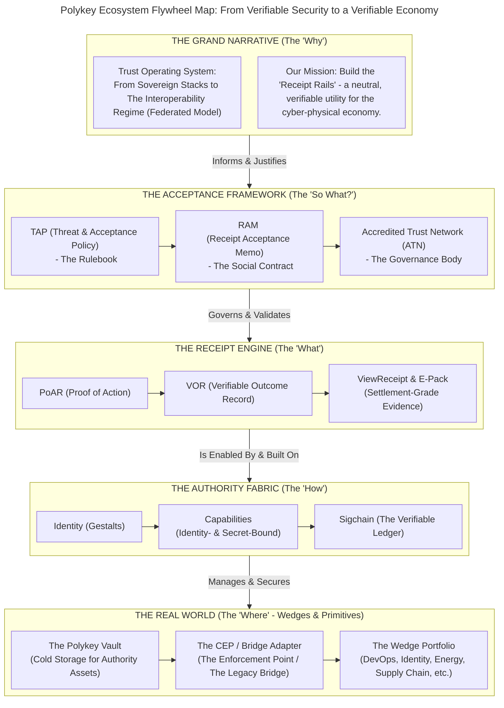

# Trust Operating System

In today's interconnected world, trust is fracturing. Opaque, centralized
systems are struggling to keep pace with the complexity of global trade, AI
agency, and the need for digital sovereignty. A new foundation is needed.

Polykey is building the open, interoperable infrastructure that allows diverse,
sovereign actors to transact with cryptographic certainty. We turn real-world
actions into settlement-grade receipts, enabling a new era of secure, efficient,
and trustworthy collaboration. We believe the future is not about closed,
competing stacks, but about shared, open protocols that create value for
everyone.

## Ecosystem Flywheel Map

This single diagram provides the complete, top-level map of Polykey's ecosystem
virtuous cycle, showing how each layer and component logically enables the next,
from the deepest "why" to the most practical "where."

### How to Read This Diagram

1. **The Grand Narrative (Top):** This is the mission. It's the big story about
   the global shift towards a new way of organizing trust.
2. **The Acceptance Framework (Layer 2):** This is the crucial socio-technical
   layer that translates the vision into something the real world can accept.
   The TAP is a set of rules, the RAM is the proof that powerful entities
   (insurers, regulators) agree to the rules, and the ATN is the resulting
   network of trusted actors.
3. **The Receipt Engine (Layer 3):** This is the core "product" of the system.
   It's the engine that runs on the authority fabric to produce the valuable
   artifacts (PoARs, VORs, and ViewReceipts) that are governed by the Acceptance
   Framework.
4. **The Authority Fabric (Layer 4):** This is the foundational technology, the
   "how." It's the deep, non-consensus innovation of Polykey: the combination of
   sovereign Identity, a rich Capability model, and the immutable Sigchain
   ledger.
5. **The Real World (Bottom):** This is where the rubber meets the road.
   - The **Polykey Vault** is the essential primitive for securely storing the
     "cold" assets of the Authority Fabric.
   - The **CEP / Bridge Adapter** is the enforcement point that connects the
     Authority Fabric to the real world, allowing it to mint receipts.
   - The **Wedge Portfolio** is the strategic application of this entire stack
     to solve specific, high-value problems in the market.

### The Flywheel Effect

- Success in the Wedges proves the value of the entire stack.
- This drives adoption of the Primitives (Vaults, CEPs).
- Which generates more activity in the Authority Fabric and the Receipt Engine.
- Which creates more demand for a robust Acceptance Framework (more TAPs and
  RAMs).
- Which, in turn, validates and strengthens the Grand Narrative, attracting more
  partners and capital to launch new Wedges.
